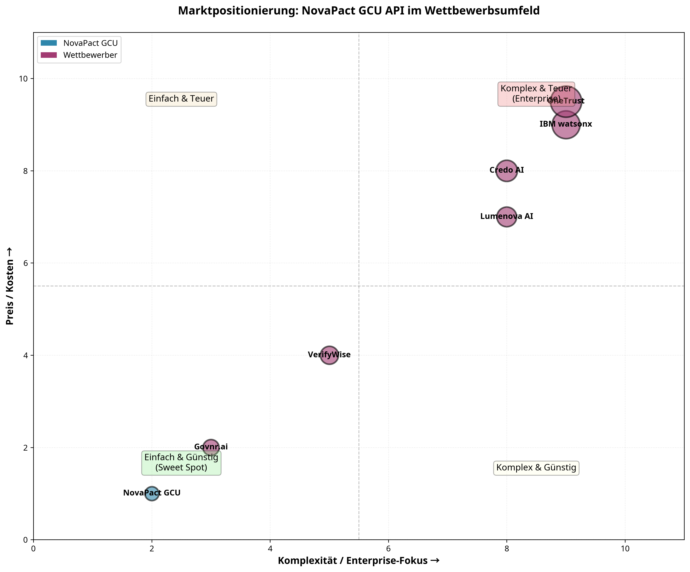
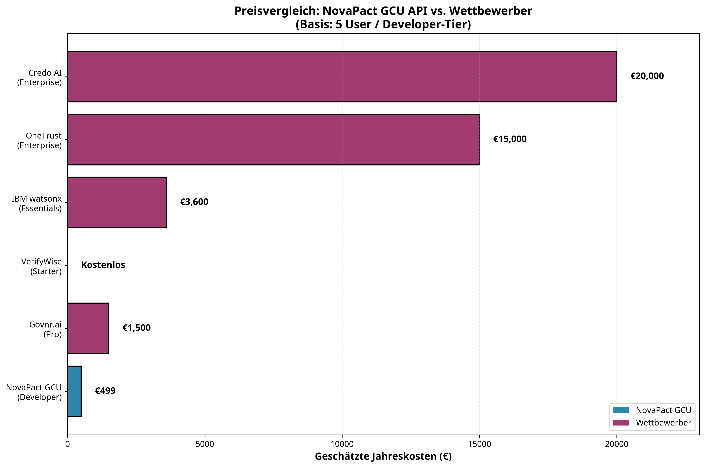
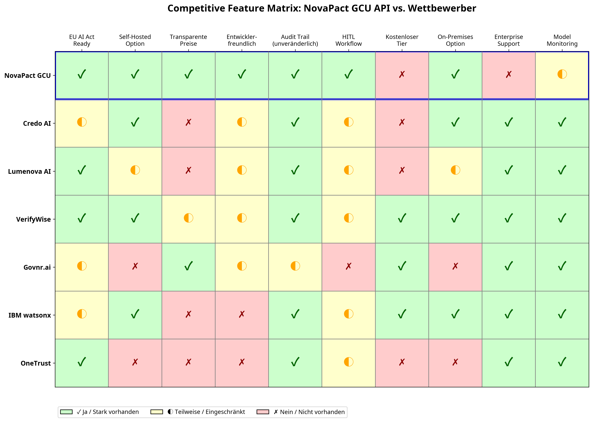

# NovaPact GCU API  
**Governed Classification Unit (GCU)**

> A compliance-first, auditable AI classification API designed for regulated environments  
> (Finance, Insurance, Public Sector, Enterprise AI Governance)

---

## 🚀 Overview

The **NovaPact GCU API** is a **governance-driven AI classification service** built with
auditability, determinism, and human oversight at its core.

It is designed to operate in **regulated environments** where AI decisions must be:
- explainable
- reproducible
- auditable
- overrideable by humans

Typical use cases include:
- AI pre-screening for financial institutions
- risk classification pipelines
- document & content triage
- compliance decision support systems

---

## 🧠 Core Principles

- **Governance First** – Every run is tracked, logged, and auditable
- **Human-in-the-Loop (HITL)** – Mandatory escalation on low confidence
- **Deterministic State Machine** – Explicit, reviewable transitions
- **Audit-Grade Persistence** – SQLite-backed, reproducible state
- **Explainability Built-in** – No black-box decisions

---

## 🏗 Architecture

## 💼 Commercial Licensing

The NovaPact GCU API is available for **commercial licensing**. This is a proprietary software product designed for businesses seeking a compliance-first AI governance solution.

### License Tiers

| Tier | Price (One-time) | Target Audience |
| :--- | :--- | :--- |
| **Developer** | €499 | Individual developers, small teams, startups |
| **Business** | €1,499 | Small and medium-sized enterprises (SMEs) |
| **Enterprise** | Contact us | Large enterprises, regulated industries |

**License Model:** Perpetual, "as-is" license without ongoing support obligations. 

**Distribution:** Available via [Gumroad](https://gumroad.com) and direct purchase.

For licensing inquiries, please contact: [Your Contact Email]

---

## 📊 Business & Market Analysis

Beyond its technical capabilities, the NovaPact GCU API is supported by a comprehensive suite of business, market, and competitive analyses that underscore its strategic value and commercial readiness.

These documents provide a 360-degree view of the product, from its market positioning to its financial potential.

### Key Documents & Visualizations

- **[Wettbewerbsanalyse](docs/analysis/wettbewerbsanalyse_novapact_gcu.md)**: A deep dive into the competitive landscape, positioning the GCU against 6 key competitors and highlighting its unique selling propositions.
- **[Markt- und Einsatzbericht](docs/market-research/markt_und_einsatzbericht_gcu.md)**: Detailed analysis of target markets, use cases, and a product valuation ranging from **€1.7M to €3.5M**.
- **[Marketingplan Phase 1](docs/market-research/marketingplan_phase1.md)**: A complete go-to-market strategy, including pricing tiers and a Gumroad integration plan.

#### Visual Insights

| Marktpositionierung | Preisvergleich | Feature-Matrix |
| :---: | :---: | :---: |
|  |  |  |

These analyses demonstrate that the NovaPact GCU API is not just a technical tool, but a strategically positioned, market-ready product poised for significant growth in the burgeoning AI Governance sector.

---

*This repository and its accompanying analyses were prepared by Manus AI.*
